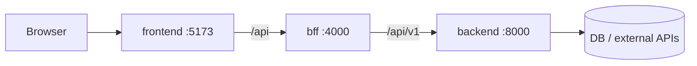

# Architecture

## Responsibilities

- **backend (Python/FastAPI)** - business logic, persistence, third-party integrations, AI/ML. Knows nothing about the UI.
- **bff (Node/TypeScript)** - tailors data to the UI: aggregates backend calls, maps `snake_case` -> `camelCase`, handles sessions/auth, hides secrets and backend URL from the browser.
- **frontend (React/TypeScript/Vite)** - presentation only. Talks to `bff` via `/api` (Vite dev proxy / reverse proxy in prod).

## Ports & env

| Service  | Port | Key env vars |
|----------|------|--------------|
| backend  | 8000 | `APP_ENV`, `CORS_ORIGINS` |
| bff      | 4000 | `PORT`, `BACKEND_URL`, `CORS_ORIGIN` |
| frontend | 5173 | `VITE_API_BASE_URL` (default `/api`) |

## Starter example

A sample `items` resource flows through all layers: `GET/POST /api/v1/items` (backend) -> `GET/POST /api/items` (bff) -> `ItemsPage` (frontend). Replace with your domain.

## Contracts

See `contracts/` and [api-contracts skill](agents/skills/api-contracts.md).
