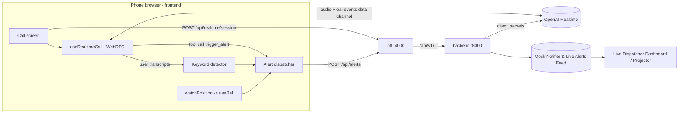
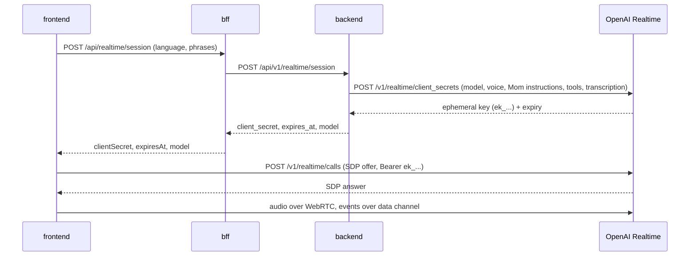
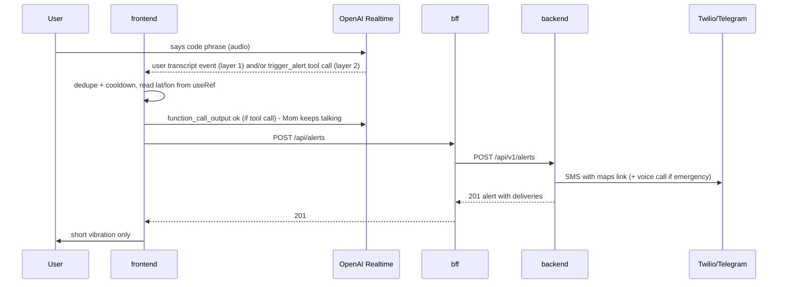

# Project Plan - Guardian Agent

HackYeah 2026 | 22 h | team of 3

Inputs used: [localisation.md](localisation.md), [research_wykrywanie_slowa.md](research_wykrywanie_slowa.md), [dane-wyjściowe.pdf](dane-wyjściowe.pdf), [ARCHITECTURE.md](ARCHITECTURE.md), [api-contracts skill](agents/skills/api-contracts.md).

Day 1 task list: [tasks/day-1.md](tasks/day-1.md) | Day 2 task list: [tasks/day-2.md](tasks/day-2.md) | Demo Script: [DEMO.md](DEMO.md)

---

## 1. Problem and product

You feel unsafe in a public place (walking home at night, someone is following you) and want to "be on the phone with someone".

Guardian Agent is a mobile-styled web app that **imitates a real phone call with "Mom"** - an AI voice agent (powered by Gemini Flash reasoning & ElevenLabs voice) that talks back naturally in **Polish or English**. Anyone nearby sees and hears a normal phone call. While you talk, the app listens for **secret code phrases**:

| Level | Example phrase (configurable) | Action (silent, call continues) |
|-------|-------------------------------|--------------------------------|
| 1 - Alert | "did you feed the cat" / "czy nakarmiłaś kota" | SMS to the trusted contact with GPS coordinates + Google Maps link. |
| 2 - Emergency | "call grandpa" / "zadzwoń do dziadka" | Level 1 SMS **plus** an automated voice call to the trusted contact (if the provider supports it). |

Plus a visible **SOS button** on the call screen that opens the phone dialer with the emergency number (`tel:`), for when the user is no longer hiding.

Code phrases sound natural in a conversation, so an attacker does not notice them. This is our main product insight - mention it in the pitch.

### MVP (must have for the demo)

1. Setup screen: language (PL/EN), trusted contact (name + phone), code phrases, emergency number. Saved in `localStorage`. Persona is fixed: **Mom**.
2. Fake call screen (incoming call -> active call with timer, avatar, hang-up, SOS).
3. Voice conversation with Mom: reasoning powered by **Google Gemini Flash** (fast, zero-cost, no credit card required) paired with ultra-realistic **ElevenLabs** voice synthesis (warm Mom voice in PL/EN).
4. Code phrase detection - two layers (see D3).
5. Continuous GPS tracking (`watchPosition`, latest value kept in `useRef`).
6. Silent alert: `frontend -> bff -> backend -> SMS provider`.
7. Discreet feedback only (short vibration), plus a hidden manual trigger for the jury demo.

### Stretch (day 2, only if MVP is done)

- Dispatcher dashboard (second screen for the jury): list of alerts + map pin + transcript snippet.
- Live location updates after the alert (send new position every N seconds).
- Mom gently asks where you are / how far from home, and the answer is added to the alert.
- PWA install, call history.

---

## 2. Key technical decisions

| # | Decision | Why |
|---|----------|-----|
| D1 | Follow repo architecture: **frontend (React) -> bff (Node/TS) -> backend (Python/FastAPI)**. Model keys, ElevenLabs, and prompts live in the **Python backend** (not Node as in `localisation.md`). | Repo rules: secrets and third-party integrations live in the backend. |
| D2 | **LLM Reasoning via Google Gemini Flash + Voice via ElevenLabs (Zero Credit Card Required).** <br>• **Reasoning:** Google Gemini 2.0 Flash / 1.5 Flash via Google AI Studio. 100% free tier (15 requests/min), requires **no credit card**. Super fast response (~200–300 ms) and handles tool calling for `trigger_alert`. <br>• **Voice:** ElevenLabs Text-to-Speech (`eleven_multilingual_v2` / Conversational AI). Free tier provides 10,000 characters/month with **no credit card required**, generating an ultra-realistic, warm Mom persona in Polish and English. | Guarantees the team is never blocked by credit card requirements, paid subscriptions, or billing limits during the hackathon. Best-in-class voice realism paired with free, reliable reasoning. |
| D3 | **Two-layer code phrase detection:** (1) **deterministic** - the session has input audio transcription enabled; the frontend runs every user transcript through our keyword detector (lowercase, no diacritics, phrase match). (2) **AI** - the session defines a tool `trigger_alert({ level, reason })`; Mom's instructions list the code phrases and tell her to call the tool when she hears them (or clear distress), then keep talking casually. Both layers go to one alert function with a cooldown, so there are no duplicates. | Layer 1 is predictable and testable. Layer 2 catches paraphrases and transcription errors ("nakarmiłaś kota?" vs "nakarmiłeś kota"). |
| D4 | **Mom never reveals the alert.** After a tool call the frontend returns `function_call_output` (`{"ok": true}`) and Mom continues the normal conversation. | The disguise must hold. |
| D5 | **Geolocation via `navigator.geolocation.watchPosition`** with `enableHighAccuracy`, value in `useRef`, `clearWatch` on unmount. No reverse geocoding. | From `localisation.md`. |
| D6 | **Silent alert must go through the backend.** Browsers cannot send SMS in the background (`sms:` opens the Messages app and breaks the disguise). | From `dane-wyjściowe.pdf`, section 1. |
| D7 | Backend uses **Mock Notifier + Live Dispatcher Dashboard** (`ALERT_PROVIDER=mock`). Telegram was evaluated and removed as unnecessary per product decision to keep the stack 100% demo-proof and focused on the dispatcher dashboard. | The demo is never blocked by external provider accounts or telecom networks. |
| D8 | **Language**: setting `pl` / `en`. It controls Mom's instructions, the transcription language hint and the UI labels (small dictionary, no i18n library). | Requirement: Polish / English. |
| D9 | **Zero-Cost & Spend Safety:** Gemini Flash and ElevenLabs free tiers require no credit card and have zero spend risk. | No risk of sudden billing cutoffs during live judging. |
| D10 | Settings stored client-side in `localStorage` and sent with requests. No accounts/auth. | Hackathon scope. |
| D11 | For testing on a real phone use an **HTTPS tunnel** (`cloudflared` / `ngrok`) to the frontend. | Mic, GPS and WebRTC need a secure context (HTTPS) on mobile. |

> **Never call 112 during development or the demo.** Use a teammate's phone number as the emergency number in settings.

---

## 3. Alert strategy for Hackathon: Mock Notifier + Live Dispatcher Dashboard

For the hackathon demo, we use a **Mock Notifier paired with a Live Dispatcher Dashboard** (projector/laptop screen):
- **Zero Telecom Friction**: No need to register paid SMS gateways, verify phone numbers on Twilio trial, or worry about SMS carrier delays in a crowded venue.
- **Superior Jury Presentation**: While the user talks on their phone, the projector screen at `/dispatcher` instantly catches the alert in real time with GPS coordinates, Google Maps link, simulated SMS payload, and speech transcript.
- **Clean Architecture**: Backend uses the Strategy pattern (`Notifier` protocol). `ALERT_PROVIDER=mock` is the sole active strategy (real telecom and push integrations like Telegram were evaluated and intentionally removed as unnecessary).

---

## 4. Architecture



### Call start sequence



### Alert sequence



---

## 5. Proposed API (draft - Person C turns this into `contracts/*.yaml` at H+0)

Backend uses `snake_case` under `/api/v1`, BFF uses `camelCase` under `/api`. Errors use the unified error format. The starter `items` resource can be removed.

### 5.1 Create realtime session

`POST /api/realtime/session` (bff) -> `POST /api/v1/realtime/session` (backend)

```jsonc
// request (bff, camelCase)
{
  "sessionId": "uuid-generated-by-frontend",
  "language": "pl",                                  // "pl" | "en"
  "alertPhrases": ["czy nakarmiłaś kota"],
  "emergencyPhrases": ["zadzwoń do dziadka"]
}
// response 201
{
  "clientSecret": "ek_...",                          // short-lived, never logged
  "expiresAt": "2026-10-03T20:16:00Z",
  "model": "gpt-realtime-..."
}
```

The backend builds the session config: Mom instructions (in the chosen language, with the code phrases), voice, `trigger_alert` tool, input audio transcription with a language hint, server-side turn detection.

### 5.2 Create alert

`POST /api/alerts` (bff) -> `POST /api/v1/alerts` (backend)

```jsonc
// request (bff, camelCase)
{
  "sessionId": "uuid",
  "level": "alert",                  // "alert" | "emergency"
  "source": "keyword",               // "keyword" | "agent" | "manual"
  "triggerPhrase": "czy nakarmiłaś kota",
  "language": "pl",
  "recipientName": "Ania",
  "recipientPhone": "+48123456789",
  "location": { "latitude": 50.0647, "longitude": 19.945, "accuracy": 12.5 }, // null if GPS unavailable
  "transcriptSnippet": "...a powiedz, czy nakarmiłaś kota..."               // optional
}
// response 201
{
  "id": "uuid",
  "mapsUrl": "https://maps.google.com/?q=50.064700,19.945000",
  "deliveries": [
    { "channel": "sms", "status": "sent" },        // channel: "mock" | "sms" | "voice" | "telegram"
    { "channel": "voice", "status": "sent" }       // status: "sent" | "failed"
  ],
  "createdAt": "2026-10-03T20:15:00Z"
}
```

### 5.3 List alerts (for dashboard, stretch)

`GET /api/alerts` -> `GET /api/v1/alerts` -> array of alerts (request fields + response fields).

### 5.4 Shared frontend type (agreed at H+0, owned by Person A)

```ts
// frontend/src/types/settings.ts
export type Language = "pl" | "en";

export interface SafetySettings {
  language: Language;
  contactName: string;
  contactPhone: string;       // E.164, e.g. +48123456789 (verified in Twilio trial!)
  alertPhrases: string[];     // level 1
  emergencyPhrases: string[]; // level 2
  emergencyNumber: string;    // SOS button; teammate number during the hackathon, NOT 112
}
```

---

## 6. Work split - three areas

Each area owns its own folders to avoid merge conflicts (see [workflow skill](agents/skills/workflow.md)).

| Area | Person | Owns | Mission |
|------|--------|------|---------|
| **A - Call Experience** | Person A | `frontend/src/` except `safety/` and `api.ts` (screens, components, `call/`, `realtime/`, `types/`, `i18n.ts`, styles) | Looks and sounds like a real phone call with Mom (UI + WebRTC Realtime client). |
| **B - AI Agent & Alert Delivery** | Person B | `backend/` | Mom's realtime session (prompt, tools, ephemeral key) and alerts that actually reach the trusted contact (SMS / voice call). |
| **C - Contracts, BFF & Safety Pipeline** | Person C | `contracts/`, `bff/`, `frontend/src/safety/`, `frontend/src/api.ts`, Docker/tunnel, later the dashboard | Glue: APIs agreed early, keyword + tool-call detection, GPS, end-to-end alert flow. |

### Interfaces between areas (agree at kickoff, then work in parallel)

- **A -> C (inside frontend):** C exports
  `useSafetyMonitor(settings: SafetySettings, sessionId: string)` returning
  `{ handleUserTranscript(text: string, isFinal: boolean): void; handleToolCall(name: string, args: unknown): void; triggerManually(level: "alert" | "emergency"): void; lastAlert: AlertResult | null; gpsStatus: "ok" | "denied" | "unavailable" | "pending" }`.
  A's `useRealtimeCall` forwards user transcription events to `handleUserTranscript` and `trigger_alert` tool calls to `handleToolCall`. A then sends the `function_call_output` back to OpenAI.
- **A <-> C (API client):** C exports `createRealtimeSession(...)` and `createAlert(...)` from `frontend/src/api.ts`. Until it's ready, A can use a temporary dev-only ephemeral key pasted at runtime (never committed) or wait for B4.
- **C <-> B (HTTP):** `contracts/backend.openapi.yaml`. C mocks the backend in BFF tests; B builds to the contract.

### Milestones (relative to start of coding, H+0)

| Milestone | Target | Definition |
|-----------|--------|-----------|
| M0 Kickoff | H+1 | Decisions confirmed, contracts merged, Gemini + ElevenLabs configured, everyone runs `make setup` + `make test` green. |
| M1 Standalone | H+4 | A: call UI + WebRTC talk with Mom. B: session + alert endpoints, provider spike decided. C: BFF routes + detector with tests. |
| M2 Integrated | H+7 | End-to-end on the laptop: talk to Mom -> code phrase -> SMS (or Telegram) received with a map link. |
| M3 Day 1 done | H+10/11 | Works on a real phone over the HTTPS tunnel, in PL and EN. Demo script rehearsed once. Everything merged to `main`. |
| Day 2 | H+11..H+22 | Polish, stretch goals, pitch deck, final rehearsal, submission. Keep 2 h buffer at the end. |

---

## 7. Decisions log

| Question | Decision |
|----------|----------|
| LLM / reasoning | Google Gemini Flash (via Google AI Studio free tier - 100% free, zero credit card requirement) |
| Voice / TTS | ElevenLabs (warm Mom persona in Polish & English - free tier, zero credit card requirement) |
| Alert channel | Mock Notifier + Live Dispatcher Dashboard (100% demo-proof, zero external telecom friction) |
| Language | Polish and English (setting) |
| Persona | Mom |
| Name | Guardian Agent |

## 8. Risks and mitigations

| Risk | Mitigation |
|------|------------|
| Noisy venue breaks recognition during the demo | Hidden manual trigger (long press on avatar); headphones with mic; pre-recorded backup video. |
| Realtime API cost / rate limits | Mini model in dev, spend limit in dashboard, hang up when not testing. |
| Mom reveals the alert or sounds like an assistant | Strong instructions (D4), short replies, test both languages; tune the prompt in B5. |
| AI layer false positives | Layer 2 only for code phrases and clear distress; cooldown; mention the trade-off in the pitch. |
| SMS provider not ready / trial limits | Telegram notifier; `mock` always works; verify demo phones early. |
| Mic/GPS/WebRTC blocked on phone | HTTPS tunnel (D11); test on the demo phone early (M3). |
| Venue Wi-Fi blocks WebRTC | Test on the venue network early; fall back to a mobile hotspot. |
| Background execution (screen off kills the mic) | Known web limitation - pitch the native/PWA roadmap (research doc section 4). |
